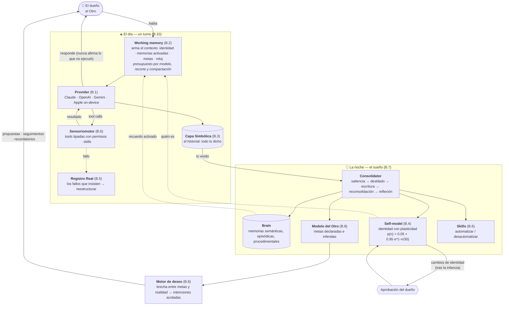

  

<h1 align="center">Anima</h1>

  <b>Un harness de agentes con forma de mente.</b> 
  <i>A mind-shaped agent harness.</i>

  <code>una mente = LLM (dotación) + harness (desarrollo) + historia (experiencia)</code>

  
  
  

Blueprint portable —agnóstico de lenguaje y de proveedor de LLM— para construir asistentes personales modelados sobre cómo el lenguaje forma la mente humana (**Chomsky · Lacan · Kandel**), con implementaciones en Swift (edge/móvil) y Go (server/daemon). Este repo es el **contrato compartido**: el spec que todos los runtimes obedecen.

## Así se ve

  
  
  
  

Chat · propuesta proactiva ligada a una meta · memoria destilada en la noche · la mente (plasticidad y ciclos de sueño). Capturas del runtime iOS en desarrollo.

## La investigación detrás

Anima no partió de código sino de una pregunta: **¿qué pasa si en vez de diseñar un agente como un pipeline de prompts, lo diseñamos como se forma una mente?** Antes de escribir una línea se hizo una investigación en tres frentes, con verificación adversarial de cada afirmación:

1. **Ingeniería de harnesses** ([doc 01](docs/01-agent-harness-manual.md)) — anatomía de un agent harness (loop, contexto, tools, memoria, fallos, seguridad, extensibilidad) y una comparativa de 8 harnesses reales.
2. **Cómo el lenguaje forma la mente** ([doc 02](docs/02-language-mind-formation.md)) — tres cuerpos de conocimiento con estatus epistémico distinto, marcado explícitamente:
   - **Lingüística — Chomsky**: competencia vs. actuación, pobreza del estímulo, la facultad del lenguaje y la recursión, la jerarquía formal.
   - **Psicoanálisis — Lacan**: el estadio del espejo, los registros Real · Simbólico · Imaginario, la primacía del significante, el gran Otro y el deseo.
   - **Neurociencia — Kandel**: plasticidad sináptica, sistemas de memoria (H.M.), reconsolidación, períodos críticos y las bases corticales del lenguaje.
   - Y sus **convergencias y disputas**: el debate Chomsky–Piaget, la crítica empírica al innatismo (Evans & Levinson, Tomasello), el neuropsicoanálisis (Solms, Kandel) y el habla interior (Vygotsky).
3. **La convergencia harness ↔ mente** ([doc 03](docs/03-harness-mind-convergence.md), *el spec*) — esa teoría traducida a **10 subsistemas** de software con contratos, evals falsables y una **tabla de novedad honesta** contra el prior art (CoALA, MemGPT/Letta, Generative Agents, Reflexion, Voyager, ACT-R…): qué es nuevo, qué es incremental y qué ya existía.

La tesis común a los tres cuerpos: **el lenguaje no es un accesorio de una mente ya formada; es (co)constituyente de ella.** Anima la toma literal: su "mente" es lo que el lenguaje —la conversación contigo— va dejando, consolidado cada noche.

> Advertencia epistémica: la neurociencia de Kandel es ciencia experimental; la gramática universal de Chomsky está empíricamente disputada; el psicoanálisis lacaniano es un marco interpretativo, no ciencia falsable. Se usan como **fuentes de diseño**, no como afirmaciones de que el software "es" una mente.

## Cómo funciona el harness

Dos ritmos, como una mente: **el día** (cada turno de conversación) y **la noche** (el sueño que consolida). Entre ambos, el deseo empuja propuestas hacia el dueño.

Lo central: el modelo de lenguaje es **la dotación**, no la mente. Lo que hace de Anima *una* mente es el harness que decide qué entra al contexto, qué se recuerda, qué se olvida, quién es y qué desea — y la historia que tú le das. Detalle completo de cada subsistema en el [spec (doc 03)](docs/03-harness-mind-convergence.md).

## Cómo piensa

| Idea | En Anima |
|---|---|
| **El sueño consolida** (Kandel) | Cada noche, mientras el teléfono carga, un ciclo destila la conversación en memorias durables, reconsolida las viejas y reflexiona. |
| **La plasticidad decae** | `p(n) = 0.05 + 0.95·e^(−n/30)`: la identidad se moldea libre al principio y se estabiliza con las noches; pasada la infancia, cambiar quién es exige tu aprobación. |
| **El deseo del Otro** (Lacan) | Tus metas —declaradas o inferidas— motivan propuestas y seguimientos proactivos, acotados para no volverse ruido. |
| **La gramática como estructura** (Chomsky) | Tools tipadas con permisos explícitos y skills que se aprenden con la práctica: lo que hace es verificable, no solo lo que dice. |

## Los documentos

| # | Documento | Qué es |
|---|---|---|
| 01 | [Agent Harness Manual](docs/01-agent-harness-manual.md) | Anatomía de un harness (loop, contexto, tools, memoria, fallos, seguridad) + comparativa de 8 harnesses reales. Investigación con verificación adversarial. |
| 02 | [Language & Mind Formation](docs/02-language-mind-formation.md) | Cómo el lenguaje forma la mente: Chomsky (gramática generativa), Lacan (el sujeto y el significante), Kandel (neurociencia de la memoria) + convergencias documentadas. |
| 03 | [Harness–Mind Convergence](docs/03-harness-mind-convergence.md) | **El spec.** Manifiesto + arquitectura por capas: 10 subsistemas (B.1–B.10), dos perfiles de runtime (edge/server), matriz de portabilidad, evals falsables, checklist de 12 pasos. |
| 04 | [Swift Implementation Plan](docs/04-swift-implementation-plan.md) | Plan de implementación del perfil **edge** como app iOS: contratos Swift, esquema GRDB, fases 0→4, costos, seguridad. |
| 05 | [Meta Glasses Plan](docs/05-meta-glasses-plan.md) | Las gafas como **segundo cuerpo opcional** de la misma mente (DAT SDK 0.9.0, hardware-verified vía Relay): HUD, voz manos-libres, tools nuevas, track G0–G2, y el **framework de extensibilidad** (tools/skills/surfaces) para móvil y gafas. |

Léelos en orden si llegas de cero; el 03 es la referencia normativa.

## Los runtimes (repos hermanos)

| Repo | Perfil | Estado |
|---|---|---|
| [`anima-ios`](https://github.com/anima-mind/anima-ios) | **Edge** — app iOS/Swift. Consolidación al cargar = sueño; el Otro = el dueño del teléfono. Gafas Meta opcionales como segundo cuerpo ([doc 05](docs/05-meta-glasses-plan.md)). | **En pruebas de campo** (TestFlight interno) — fases 0–4 del plan implementadas: conversación, memoria y sueño, identidad con plasticidad, deseo/metas, recordatorios y seguimientos proactivos, modo 100 % on-device (Apple Foundation Models) y gafas Meta |
| [`animad`](https://github.com/anima-mind/animad) | **Server** — daemon Go y/o servicio REST. Brain compartido, capa intersubjetiva (§B.9). | **Creado** — mismo invariante con valores canónicos idénticos + CI verde. Plan server pendiente |

Regla: los cambios al blueprint se hacen aquí (PR a este repo); los runtimes se actualizan contra él. La [matriz de portabilidad](docs/03-harness-mind-convergence.md) (§C.1) define qué es invariante entre runtimes y qué varía por perfil.

## Estado

- [x] Investigación y spec (docs 01–03, verificados adversarialmente)
- [x] Plan de implementación edge/Swift (doc 04, revisado)
- [x] Plan gafas Meta (doc 05 — opcional: la app funciona con o sin gafas)
- [x] Repos de runtimes creados (públicos, CI verde): [anima-ios](https://github.com/anima-mind/anima-ios) · [animad](https://github.com/anima-mind/animad) — ambos arrancan por el invariante de plasticidad (§C.1) con valores canónicos idénticos en Swift y Go
- [x] `anima-ios` — fases 0–4 (conversa, recuerda, duerme, desea) + capa proactiva + modo on-device
- [x] `anima-ios` — track G (gafas Meta, DAT SDK 1.0)
- [ ] `anima-ios` — widgets, CarPlay y App Store
- [ ] `animad` — plan de implementación server (hermano del doc 04) + Fase 0

## Licencia

El blueprint (documentos, spec e investigación) está bajo **[Creative Commons Atribución 4.0 (CC BY 4.0)](LICENSE)**: puedes usarlo, adaptarlo y construir sobre él citando a Joshua Moreno / anima-mind. Los runtimes tienen su propia licencia: [`animad`](https://github.com/anima-mind/animad) (Apache 2.0) y [`anima-ios`](https://github.com/anima-mind/anima-ios) (PolyForm Noncommercial 1.0.0). **Anima** y su logo son marcas de Joshua Moreno; ninguna licencia otorga derechos sobre ellas.

---

*Un proyecto de [anima-mind](https://github.com/anima-mind) · Joshua Moreno · 2026*
